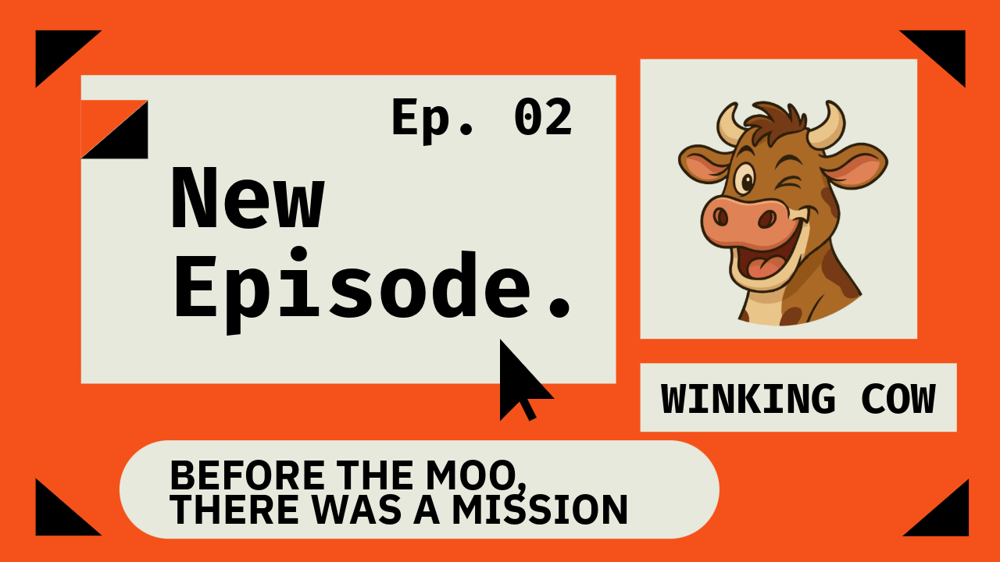

# Podcast Title
Before the Moo, There Was a Mission

**Episode:** Podcast 02

## Short Context
This episode exists to document the *why* behind Winking Cow.

After introducing the voice and soul of the project in Podcast-01, this episode steps back further in time — before the memes, before the token, before the community — to explain the mission that made everything else inevitable.

It answers a foundational question:
**What does Winking Cow stand for, beyond humor and visuals?**

This episode frames Winking Cow as a culture first and a coin second, grounding the project in belief, intention, and long-term purpose rather than speed or hype.

## Where Can You Hear This Podcast
- Website: https://www.podcast.winkingcow.com/before-the-moo-there-was-a-mission/
- Twitter (X): https://x.com/WinkingCowToken/status/1953940031095161036
- YouTube: https://youtu.be/_k9T3DnRP7Y
- Spotify: https://open.spotify.com/episode/4qIHsUcnDEUh9eZCVgIwz4
- Rumble: https://rumble.com/v72qhjq-podcast-episode-02-before-the-moo-there-was-a-mission..html

## Full Script
This episode is not about what has been built.
This is about why the journey began.
Why the Cow winked.
Why the silence broke.
and Why the chaos chose meaning.

Winking Cow did not arrive from noise.
It arrived from stillness.
Not from hype, but from a heartbeat.
A quiet pull. And, A strange certainty.

From belief.
From rebellion.
From the beautiful discomfort of building differently.

Before the memes...
Before the token...
Before the herd...

There was a reason to wink.
A reason to build.
A reason to moo.

The vision is clear.
To shape a decentralized culture
where joy, rebellion, and community
grow stronger with every wink,
every meme,
every moo.

To imagine a world where humor becomes power.
Where cows do not need passports.
And where each believer becomes a builder.

The mission is to grow Winking Cow
into a beloved meme coin ecosystem
rooted in art,
guided by utility,
driven by participation,
and wrapped in bold, fearless storytelling.

This Cow does not copy.
This Cow does not chase.
This Cow moves in its own rhythm.

It rewards belief.
It builds like no one is watching —
and winks like everyone is.

Winking Cow is not just a token.
It is a tone.
A temperament.
A way of being.

It stands for:

Joy as Rebellion
In a world obsessed with seriousness, the Cow laughs.
That is the protest.

Belief Over Hype
There is no rush.
No artificial fire.
Only cow speed — slow, sacred, intentional.

Wisdom in Whimsy
Every meme carries meaning.
Every wink holds a philosophy.

Chaos, But Crafted
What appears silly is often strategic.
What feels random is anchored in purpose.

Community First
No velvet ropes.
No secret gates.
If the heart believes, the door is already open.

This is not just a moo-vement.
This is a remembering.
Of something ancient.
Of something new.

The voice may pause…
but the mission continues.

The Cow has spoken.

## Notes
This episode formally defines the mission and values that guide every future decision in the Winking Cow ecosystem.

It should be read as a mission document in spoken form, setting constraints and intent for how the project grows, communicates, and resists shortcuts.
