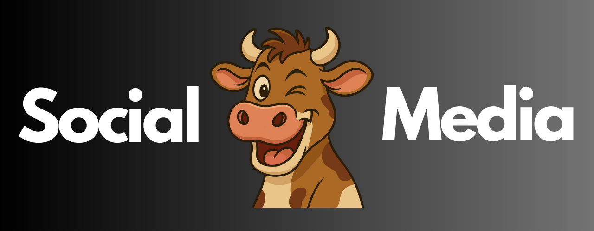

# Where to Follow the Thinking

This page documents the official social media presence of the **Winking Cow** project.

We do not treat social media as promotion.
We treat it as a public archive of ideas, visuals, conversations, and long-form thinking.

---

## Core Presence

- **Website**  
  https://www.winkingcow.com  

- **X (Twitter)**  
  https://x.com/winkingcow  

---

## Video, Audio & Documentation

- **GitHub**  
  https://github.com/WinkingCow/WinkingCow  

- **YouTube**  
  https://www.youtube.com/@WinkingCowToken  

- **Spotify**  
  https://open.spotify.com/show/2kU8vmrpK77WVUM4otPR1a  

- **Rumble**  
  https://rumble.com/user/WinkingCowToken  

---

## Writing, Visuals & Community

- **Substack**  
  https://substack.com/@winkingcow  

- **Wattpad**  
  https://www.wattpad.com/winkingcow  

- **Bluesky**  
  https://bsky.app/profile/winkingcow.bsky.social  

- **Pinterest**  
  https://www.pinterest.com/winkingcowpins/  

- **LinkedIn**  
  https://www.linkedin.com/in/winkingcow/  

- **Quora**  
  https://www.quora.com/profile/Winking-Cow  

---

## Notes

- This list reflects only official and active platforms.
- No paid amplification.
- No artificial growth.
- Each platform exists for a specific purpose.

More will be added when **they earn their place**.
